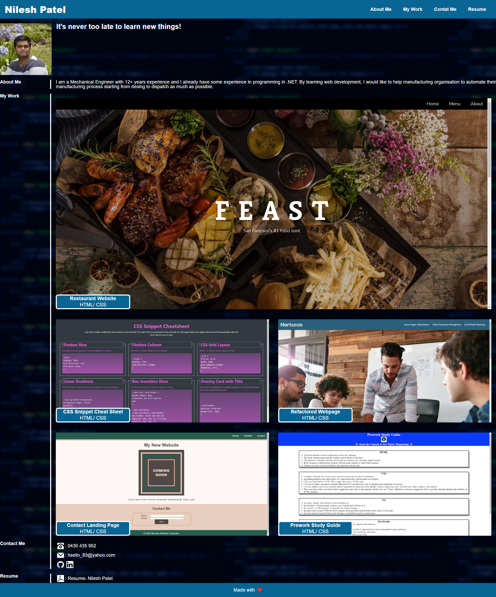

# portfolio
Portfolio Website

## Description
A portfolio website has been created displaying following information.
- Name in the header.
- Recent photo.
- Navigation links that scrolls to corresponding section.
- Section about recent projects completed.
- First applications image is larger in size than other applications.
- When the project image is hovered over, displays a shadow.
- When the project image is clicked, takes the user to the deployed webpage of the project.
- Contact section showing contact details including links to GitHub and LinkedIn profile.
- Resume section where user can view developers resume in new window.

## Deployment
The webpage is deployed to GitHub pages. Use below link to visit the webpage: https://nileshpatel83.github.io/portfolio/

## Screenshots
- At size more than 768 pixel, the page resembles as following:

- At size 768 pixel and below, the page resembles as following:

## License
Please refer to the LICENSE in the repo.